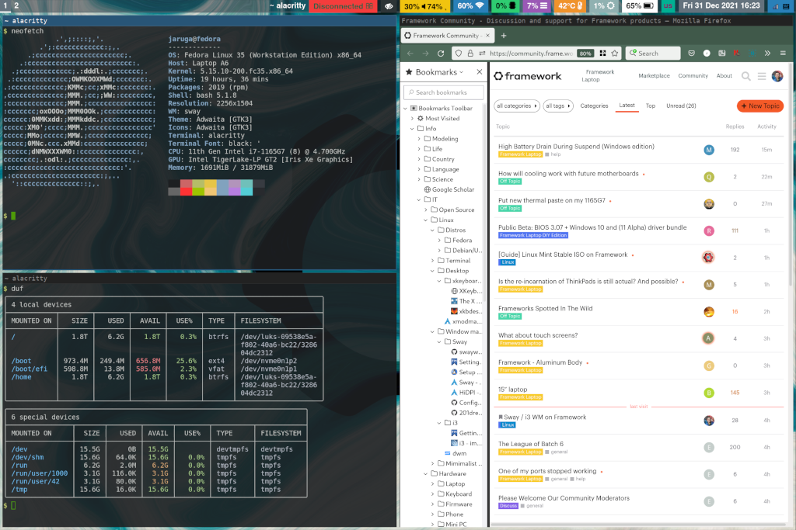
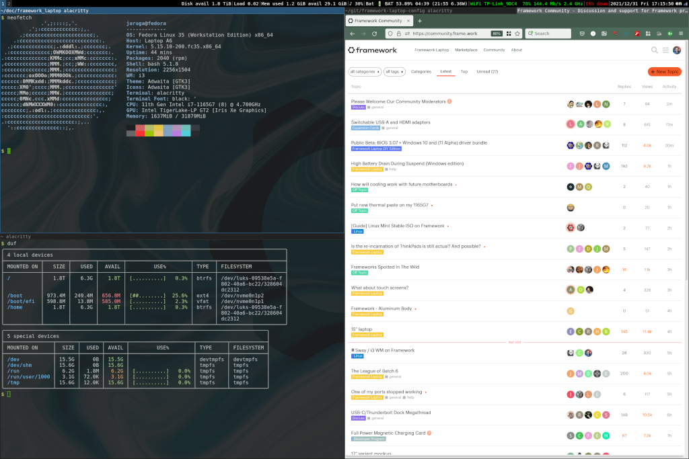

# Configuration files for Framework Laptop.

This repository is to share a part of my configuration files on Framework Laptop for people who are interested in using Sway or i3 window manager on Framework Laptop. My environment is Fedora Linux. I don't intend to update this repository regularly. The files are just a snapshot.

The following config files are included:

* Sway (window manager)
  * Using Waybar.
  * Using i3status optionally.
  * Using `home/.xkb/` optionally. Sway has a feature to load `~/.xkb`.
* i3 (window manager)
  * Using i3status.
  * Using Compton.
  * Using `.Xmodmap`. Only i3 loads the `.Xmodmap`. Sway doesn't load it.
  * Using `usr/share/X11/xkb/` optionally. But make sure that it's risky to edit files under the /usr.
* VIM: In the `.vimrc`, the `highlight` settings are related to the terminals.
* Alacritty (terminal)
* Terminator (terminal)
* `.bash_profile`: It seems that this file is only loaded by i3, not by Sway.
* `.bashrc`: Only contents related to window managers and terminals.

## License

Public Domain (CC0)

## Screenshots

### Sway



### i3



## File list

The directory structure is equivalent with the actual directores under the root "/".

```
$ tree -a home/ usr/
home/
├── .bash_profile
├── .bashrc
├── .bashrc.d
│   └── 40-fcitx.sh
├── .config
│   ├── alacritty
│   │   ├── alacritty.yml
│   │   └── framework.yml
│   ├── compton.conf
│   ├── i3
│   │   └── config
│   ├── i3status
│   │   └── config
│   ├── sway
│   │   └── config
│   ├── terminator
│   │   └── config
│   └── waybar
│       ├── config
│       └── style.css
├── .vimrc
├── .xkb
│   ├── rules
│   │   ├── evdev
│   │   └── evdev.org
│   └── symbols
│       └── custom
└── .Xmodmap
usr/
└── share
    └── X11
        └── xkb
            ├── rules
            │   ├── evdev
            │   ├── evdev.org
            │   ├── evdev.xml
            │   └── evdev.xml.org
            └── symbols
                ├── capslock
                └── capslock.org
```

## References

Here are useful examples that you may refer.

* Sway config: https://github.com/201dreamers/sway-config

* i3 config: https://github.com/LukeSmithxyz/voidrice

  ```
  $ git checkout https://github.com/LukeSmithxyz/voidrice.git
  $ cd voidrice
  $ git checkout ad161d9363aadeb9f4ec3c852ca6c96162f2b4b0
  $ vi .config/i3/config
  ```

## Call to action

Let's share your config files for Framework Laptop!
