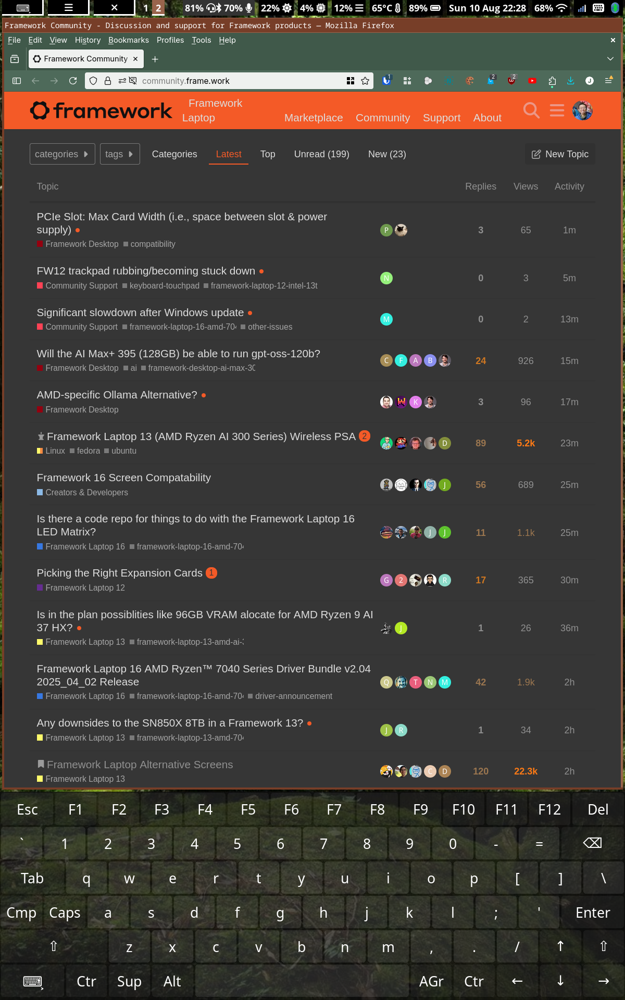

# Configuration files for Framework Laptop

This repository is to share a part of my configuration files on Framework Laptop. My environment is Fedora Linux. I don't intend to update this repository regularly. The files are just a snapshot.

The following application's config files are included:

* [Sway](https://swaywm.org/) (window manager)
  * `home/.config/xkb/` for keyboard mappings. Sway has a feature to load `~/.config/xkb`.
  * [Waybar](https://github.com/Alexays/Waybar)
  * [Wvkbd](https://git.sr.ht/~proycon/wvkbd)
* [i3](https://i3wm.org/) (window manager)
  * [i3blocks](https://github.com/vivien/i3blocks) with [i3blocks-contrib](https://github.com/vivien/i3blocks-contrib) original version and my [forked custom version](https://github.com/junaruga/i3blocks-contrib/tree/mine) until my pull-requests are merged in the original version.
  * `etc/X11/xorg.conf.d/*.conf` for the input device settings.
  * `.Xmodmap`. Only i3 loads the `.Xmodmap`. Sway doesn't load it.
  * `/usr/share/X11/xkb/symbols/custom` for custom keyboard layout. See [this page on my blog](https://junaruga.hatenablog.com/entry/2022/08/11/165301) for details.
* VIM: In the `.vimrc`, the `highlight` settings are related to the terminals.
* [Alacritty](https://alacritty.org/) (terminal)
* [Terminator](https://gnome-terminator.org/) (terminal)
* [Mouseless](https://github.com/jbensmann/mouseless)
* `.bash_profile`: It seems that this file is only loaded by i3, not by Sway.
* `.bashrc`: Only contents related to window managers and terminals.

## License

Public Domain (CC0)

## Screenshots

### Framework Laptop 12 Sway




### Framework Laptop 13 Sway


### Framework Laptop 13 i3


## File list

The directory structure is equivalent with the actual directories under the root "/". You can run the following command to find the directory structure.

```
$ tree -a etc/ home/ usr/
```
## References

Here are useful examples that you may refer.

* Sway config: https://github.com/201dreamers/sway-config

* i3 config: https://github.com/LukeSmithxyz/voidrice

  ```
  $ git checkout https://github.com/LukeSmithxyz/voidrice.git
  $ cd voidrice
  $ git checkout ad161d9363aadeb9f4ec3c852ca6c96162f2b4b0
  $ vi .config/i3/config
  ```

## Config tips

I am sharing the configuration tips for Framework Laptop on this repository's [wiki](https://github.com/junaruga/framework-laptop-config/wiki).

## Call to action

Let's share your config files for Framework Laptop!
